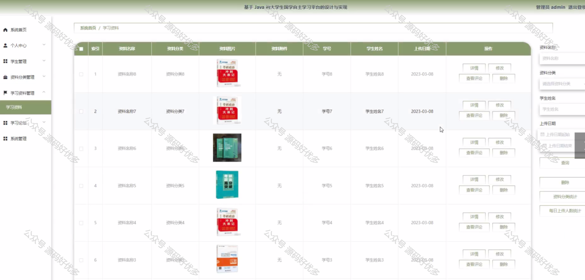

 
## 查看主页获取源码

### 一、作品包含

源码+数据库+设计文档万字+PPT+全套环境和工具资源+部署教程

### 二、项目技术

前端技术：Html、Css、Js、Vue、Element-ui

数据库：MySQL

后端技术：Java、Spring Boot、MyBatis

  

### 三、运行环境

开发工具：IDEA/eclipse

数据库：MySQL5.7

数据库管理工具：Navicat10以上版本

环境配置软件： JDK1.8+Maven3.6.3

前端Nodejs：14

### 四、项目介绍
项目编号：springbootA194

在传统文化复兴和现代教育技术不断发展的双重背景下，大学生国学自主学习平台应运而生。该平台旨在满足当代大学生对国学知识深入学习的需求，通过整合丰富的国学资源，运用先进的网络技术和多媒体手段，为大学生提供一个便捷、高效、互动的自主学习环境，从而促进国学文化的传承与创新，增强学生的文化自信和民族认同感。

前台学生功能：浏览首页、学习资料、学习论坛、公告信息、后台管理、个人中心。

后台分为管理员和学生
管理员的功能：系统首页、个人中心、学生管理、资料分类管理、学习资料管理、学习论坛、系统管理。
学生的功能：系统首页、个人中心、学习资料管理。

### 五、运行截图

  
